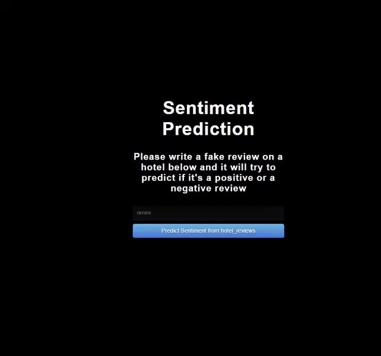
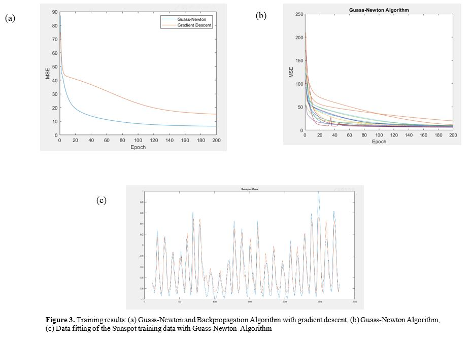
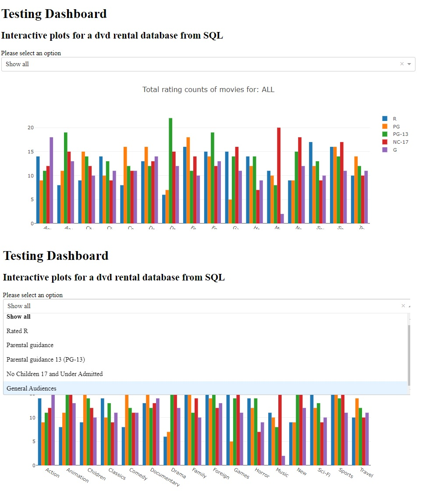

## Summary

Hi my Name is Nayan.

Graduate M.Sc in Computational Cognitive Neuroscience.

## Projects

### <a href="https://nyanonyan.github.io/-EDA-and-Forecasting-on-weekly-petrol-and-diesel-data/">1) EDA and Forecasting on weekly petrol and diesel data in the UK</a>

### <a href="https://nyanonyan.github.io/Hotel_reviews_sentiment_analysis/">2) Hotel reviews prediction using Sentiment Analysis</a>

### <a href="https://nyanonyan.github.io/Gauss-Newton-Method-Algorithm/">3) Training Sunspot Data using Gauss-newton method (using the Hessian matrix)</a>

### <a href="https://nyanonyan.github.io/Data_Analysis_Dashboard/">4) Data_Analysis_Dashboard</a>

